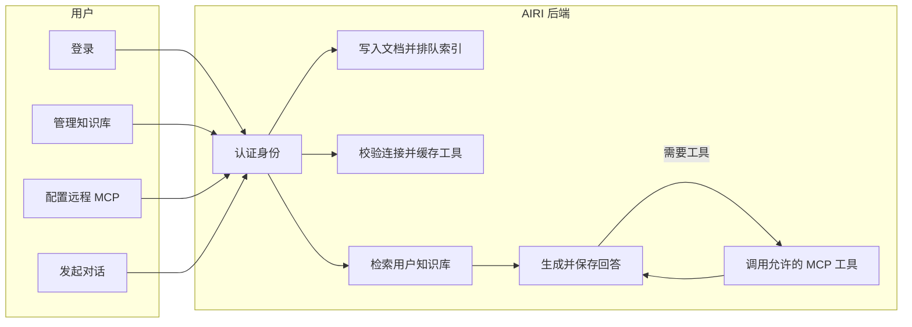
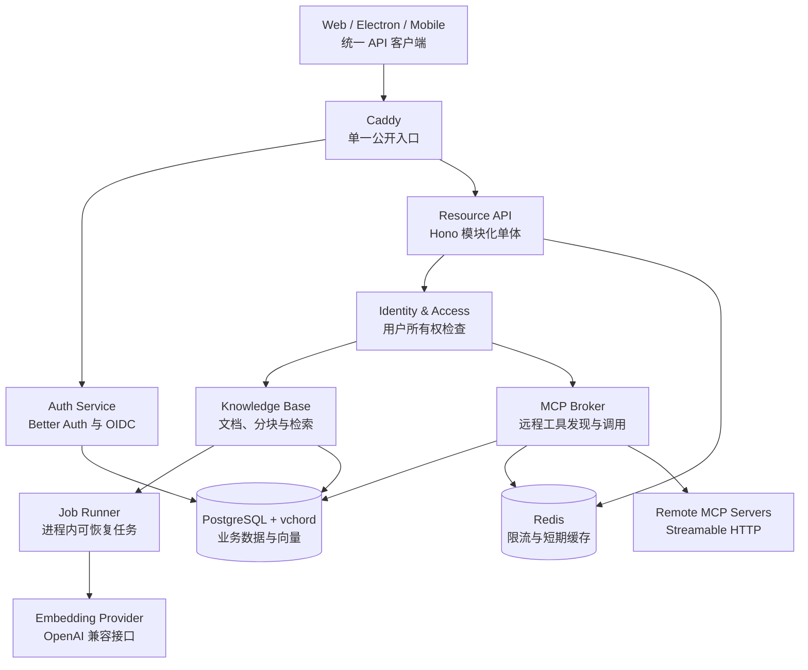

# 用户请求流程

```mermaid
flowchart LR
  subgraph U[用户]
    U1[登录]
    U2[管理知识库]
    U3[配置远程 MCP]
    U4[发起对话]
  end
  subgraph A[AIRI 后端]
    A1[认证身份]
    A2[写入文档并排队索引]
    A3[校验连接并缓存工具]
    A4[检索用户知识库]
    A5[调用允许的 MCP 工具]
    A6[生成并保存回答]
  end
  U1 --> A1
  U2 --> A1 --> A2
  U3 --> A1 --> A3
  U4 --> A1 --> A4 --> A6
  A6 -->|需要工具| A5 --> A6
  click A1 "modules/identity-and-access.md"
  click A2 "modules/knowledge-base.md"
  click A3 "modules/mcp-runtime.md"
  click A4 "modules/knowledge-base.md"
  click A5 "modules/mcp-runtime.md"
  click A6 "modules/api-orchestration.md"
```

# 系统架构

```mermaid
flowchart TB
  C[Web / Electron / Mobile<br/>统一 API 客户端]
  E[Caddy<br/>单一公开入口]
  AU[Auth Service<br/>Better Auth 与 OIDC]
  API[Resource API<br/>Hono 模块化单体]
  IAM[Identity & Access<br/>用户所有权检查]
  KB[Knowledge Base<br/>文档、分块与检索]
  MCP[MCP Broker<br/>远程工具发现与调用]
  JOB[Job Runner<br/>进程内可恢复任务]
  DB[(PostgreSQL + vchord<br/>业务数据与向量)]
  R[(Redis<br/>限流与短期缓存)]
  RMCP[Remote MCP Servers<br/>Streamable HTTP]
  EMB[Embedding Provider<br/>OpenAI 兼容接口]
  C --> E
  E --> AU
  E --> API
  API --> IAM
  IAM --> KB
  IAM --> MCP
  KB --> JOB
  JOB --> EMB
  KB --> DB
  MCP --> DB
  MCP --> R
  MCP --> RMCP
  API --> R
  AU --> DB
  click AU "modules/identity-and-access.md"
  click IAM "modules/identity-and-access.md"
  click API "modules/api-orchestration.md"
  click KB "modules/knowledge-base.md"
  click MCP "modules/mcp-runtime.md"
  click JOB "modules/knowledge-base.md"
  click DB "modules/data-model.md"
  click R "modules/deployment.md"
  click RMCP "modules/mcp-runtime.md"
  click EMB "modules/knowledge-base.md"
```
